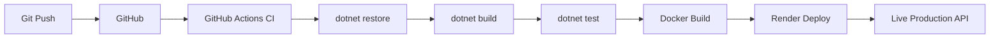

# 🚀 DotNet DevOps Pipeline


<p align="left">
  
  
</p>

<p align="left">
  
</p>

---

# 📌 Project Overview

**DotNet DevOps Pipeline** is a **fully automated production-ready CI/CD DevOps showcase project** built using **.NET 8, Docker, GitHub Actions, and Render Cloud**.

This project demonstrates how to build, test, containerize, and deploy a modern web API into a real production environment using professional DevOps workflows.

---

# 🌍 Live Production URLs

| Service        | URL                                                                                                        |
| -------------- | ---------------------------------------------------------------------------------------------------------- |
| ✅ Health Check | [https://dotnet-devops-pipeline.onrender.com/health](https://dotnet-devops-pipeline.onrender.com/health)   |
| 📘 Swagger UI  | [https://dotnet-devops-pipeline.onrender.com/swagger](https://dotnet-devops-pipeline.onrender.com/swagger) |

---

# ⚡ CI/CD Pipeline Diagram (Mermaid)



---

# 📷 Application Screenshots

### ✅ Swagger UI (Production)

> *Replace this URL with your own screenshot later*

```txt
https://dotnet-devops-pipeline.onrender.com/swagger
```

---

### ✅ Render Live Deployment

```txt
https://dotnet-devops-pipeline.onrender.com
```

---

# 🧠 DevOps Automation Flow

```txt
Push → CI → Test → Docker → Cloud → Live
```

---

# 🏗️ Tech Stack

| Layer      | Technology     |
| ---------- | -------------- |
| Backend    | .NET 8 Web API |
| Logging    | Serilog        |
| Containers | Docker         |
| CI/CD      | GitHub Actions |
| Cloud      | Render         |
| Monitoring | Health Checks  |
| Docs       | Swagger        |

---

# ✨ Key Features

✅ Full DevOps lifecycle automation
✅ Dockerized cloud-native API
✅ Automated build, test, and deploy
✅ Health monitoring & logging
✅ Production deployment with zero downtime triggers

---

# 📂 Project Structure

```txt
DotnetDevopsPipeline
 ├─ DotnetDevopsPipeline.Api
 │   ├─ Controllers
 │   ├─ Program.cs
 │   ├─ Dockerfile
 │   ├─ appsettings.json
 │   └─ Properties
 ├─ .github
 │   └─ workflows
 │       └─ dotnet-ci.yml
 ├─ .gitignore
 └─ README.md
```

---

# 🐳 Docker Usage (Local)

### Build Image

```bash
docker build -t dotnetdevopspipeline .
```

### Run Container

```bash
docker run -p 8080:8080 dotnetdevopspipeline
```

---

# ✅ Local Access

* Swagger: [http://localhost:8080/swagger](http://localhost:8080/swagger)
* Health: [http://localhost:8080/health](http://localhost:8080/health)

---

# ⚙️ GitHub Actions CI/CD

Defined in `.github/workflows/dotnet-ci.yml`

### Triggered on

* Push to `main`
* Pull Requests

### Pipeline Steps

* Restore
* Build
* Test
* Docker Image Build
* Auto Deploy to Render

---

# ☁️ Render Cloud Deployment

Uses Docker-based deployment with real-time health checks.

```
ASPNETCORE_URLS=http://+:8080
```

---

# 🔍 Health Check Endpoint

```http
GET /health
```

---

# 🏆 Career-Level Impact

✅ Demonstrates Production CI/CD expertise
✅ Shows real DevOps toolchain usage
✅ Proves cloud-native deployment skills

---

# 👨‍💻 Author

**CodeByPinar**
[https://github.com/CodeByPinar](https://github.com/CodeByPinar)

---

# 🔮 Future Enhancements

* API Versioning
* Authentication
* Database Integration
* Metrics Monitoring (Prometheus)
* Distributed tracing

---

# ✅ License

MIT
